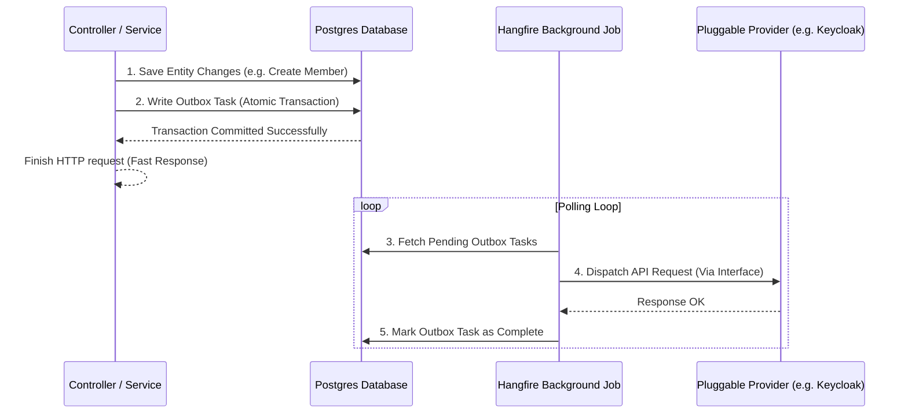

Tavern's backend is implemented using **ASP.NET Core 8.0 Web API** and adheres to structured software design patterns ensuring separation of concerns, transactional safety, and eventual consistency.

---

## Architectural Layout (N-Tier Pattern)

The codebase is organized into layers separating HTTP transport logic, data management, and business logic domain services:

```
┌────────────────────────────────────────────────────────┐
│                      Controllers                       │
│    HTTP Request Handling, JSON serialization/routing   │
└──────────────────────────┬─────────────────────────────┘
                           │ (Direct Service Call)
┌──────────────────────────▼─────────────────────────────┐
│                    Domain Services                     │
│    EF Core operations, domain logic, authorization     │
│    (Injects and uses Helper Services & Providers)      │
└──────────────────────────┬──────────────┬──────────────┘
                           │              │
 ┌─────────────────────────▼──┐        ┌──▼────────────────────────┐
 │   PostgreSQL (Database)    │◄───────┤  Services (Helper logic)  │
 └────────────────────────────┘        └───────────────────────────┘
```

1. **Controllers:** Manage REST API endpoints, validate incoming request models, serialize responses, and handle HTTP status codes. They delegate requests to domain services.
2. **Domain Services (`Services/Domain`):** Execute business logic, enforce domain permissions and authorization checks, coordinate entity validation, and interface directly with Entity Framework Core (`PostgresDbContext`) to execute database operations and transactions.
3. **Helper & Provider Services (`Services/`):** House business logic helpers, specialized features, and third-party provider implementations. They can also directly query/access the PostgreSQL database context when needed. For example, `PaymentValidationService` verifies membership and activity payment records, `PermissionService` checks group memberships, and `KeycloakAPIService` handles identity management.

---

## Codebase & Folder Organization

The `Backend` project directory contains the following folders and components:

* **`Controllers/`**: Houses the API controllers that define REST endpoints. They handle incoming HTTP requests, serialize/deserialize JSON, and coordinate requests to the domain service layer.
* **`Controllers/DTOs/`**: Defines the Data Transfer Objects (DTOs) used for API requests and responses, as well as static `ToDto()` LINQ projection methods.
* **`Database/`**: Contains the Entity Framework Core database context (`PostgresDbContext.cs`) and database seeding configurations (`DatabaseSeeder.cs`).
* **`Filters/`**: Custom action, schema, and API document filters for ASP.NET Core (such as custom Swagger/OpenAPI documentation schema mapping).
* **`Interfaces/`**: Holds the interfaces and contracts for domain services and provider integration services, maintaining the Dependency Inversion Principle.
* **`Middleware/`**: Contains custom ASP.NET Core HTTP pipeline middleware (such as `ExceptionHandlingMiddleware` for global error handling).
* **`Migrations/`**: Automatically generated EF Core database schema migration files.
* **`Models/`**: Defines the database entities and core domain enumerations.
* **`QueryExtensions/`**: Houses reusable LINQ query extensions to filter and load database query streams cleanly.
* **`Services/`**: Contains domain services (`Services/Domain/`), third-party SaaS integrations (Mollie, Mailchimp, Keycloak), outbox task workers, and Hangfire background jobs.
* **`Utils/`**: Reusable helper functions and general utilities (e.g., date-time helpers).
* **`Validators/`**: Contains model validation classes (leveraging FluentValidation) to validate incoming HTTP payloads before any business actions occur.

---

## Pluggable Integration Services (Strategy Pattern)

To avoid hard coupling to specific third-party SaaS APIs, Tavern encapsulates external interactions behind interfaces. The concrete implementations are instantiated dynamically at startup based on the environment variables defined in `ServiceExtensions.cs`:

| Interface | Purpose | Concrete Implementations | Configuration Variables |
| :--- | :--- | :--- | :--- |
| **`IAuthService`** | User profile creation, realm sync, authentication | `KeycloakAPIService` | `AUTH_SYSTEM=keycloak` |
| **`IStorageService`** | Object photo upload and storage management | `S3StorageService` | `S3_SERVICE_URL`, `S3_ACCESS_KEY_ID` |
| **`AbstractPaymentService`** | Generating checkout intents, webhook parsing | `MollieService` | `PAYMENT_PROVIDER=mollie` |
| **`AbstractMailService`** | Dispatching system emails and invoices | `MailgunService`<br/>`SMTPMailService` | `MAIL_SERVICE=MAILGUN`<br/>`MAIL_SERVICE=SMTP` |
| **`IAccountingToolService`** | Syncing payments to bookkeeping ledgers | `ExactService` | `ACCOUNTING_SERVICE=EXACT` |
| **`IMailSubscriptionService`** | Managing user newsletter subscription states | `MailChimpSubscriptionService` | `MAIL_SUBSCRIPTION_SERVICE=MAILCHIMP` |

By structuring integrations this way, developers can easily write a new class (e.g. `Auth0APIService` or `StripePaymentService`) implementing the respective interface and register it inside `ServiceExtensions.cs` without having to change the core database models or controller routes.

---

## Background Processing (Hangfire)

To avoid blocking HTTP threads during long-running tasks, Tavern uses **Hangfire** for scheduling and executing background jobs:
* **Storage:** Job states and execution history are stored in dedicated schema tables inside the PostgreSQL database.
* **Concurrency:** Runs on isolated worker pools, ensuring API responsiveness is never degraded by background operations.
* **Tasks Managed:** Processing outbox queues, updating user email records from Keycloak, executing nightly payment syncs, and broadcasting transactional notifications.

---

## Transactional Outbox Pattern

To achieve reliable integration with third-party APIs without sacrificing database transactional safety, Tavern implements the **Transactional Outbox Pattern**:



### Why we use this pattern:
If the API attempted to write directly to database tables AND call third-party HTTP endpoints within a single request, a network failure would leave the system in an inconsistent state (e.g., database updated, but Keycloak synchronization failed).
By writing a record of the sync request into the database in the *same* transaction as the primary entity changes, we guarantee eventually consistent operations.

### Outbox Tasks & Workers:
* **`AuthOutboxTask` / `AuthOutboxWorker`:** Synchronizes user registrations and updates with the configured `IAuthService`.
* **`MailSubscriptionOutboxTask` / `MailSubscriptionOutboxWorker`:** Syncs user newsletter choices with the configured `IMailSubscriptionService`.
* **`AccountingToolOutboxTask` / `AccountingToolOutboxWorker`:** Exports payment and sales records to the configured `IAccountingToolService`.

---

## Personal Calendar Feeds (iCalendar)

Each member has a private iCalendar feed of the activities they are enrolled in, built by `CalendarService` and served at
`GET /calendars/{calendarId}`. Because calendar applications cannot authenticate, that endpoint is anonymous and guarded
solely by `Member.CalendarId` — an unguessable random GUID that acts as a bearer secret, is never exposed through any
other endpoint, and can be regenerated via `POST /calendars/me/rotate` to revoke a leaked URL. Three details are easy
to get wrong when touching this code: the route must also answer `HEAD`, since ASP.NET Core does not route `HEAD` to
`[HttpGet]` actions and clients probe subscriptions that way; the feed is served inline as `text/calendar` rather than
as a download, because the URL is a live subscription and not a file; and whole-day events are detected by converting
to the association's timezone first (local `00:00`–`23:59`) and emitted as `VALUE=DATE` with an exclusive `DTEND`,
because activity timestamps are persisted as UTC instants and reading the date straight off the UTC value shifts it a
day for half the year.

The association's timezone is configured once through the `AssociationTimeZone` environment variable
(`Europe/Amsterdam` by default), and both halves of the stack agree on it: the frontend enters and displays every
activity time on that clock regardless of where the member's browser is, sending offset-marked timestamps such as
`2026-06-01T00:00:00+02:00`, and the backend converts the stored UTC instant back to it to recognise the whole-day
marking. Anything that needs to reason about the *day* or *time-of-day* a member entered must go through that
conversion rather than reading the UTC value directly.

---

## Payment Lifecycle & Webhook Synchronization

Tavern integrates with payment providers via `AbstractPaymentService`:

1. **Initiation:** The member requests an activity enrollment or membership purchase. The API generates a payment intent URL via the active provider and returns it.
2. **Webhook Endpoint:** When the member completes payment, the provider invokes our webhook endpoint (`PaymentsController.HandleWebhookAsync`).
3. **Event Processing:** The webhook validates the event signature and runs `AbstractPaymentService.ProcessPaidPayments` to record the paid amount and activate the registration.
4. **Resiliency Sync:** In case a webhook fails or is dropped, the `PaymentSyncService` runs a recurring Hangfire loop checking for uncompleted payment intents and synchronizing their statuses directly from the provider's status API.
