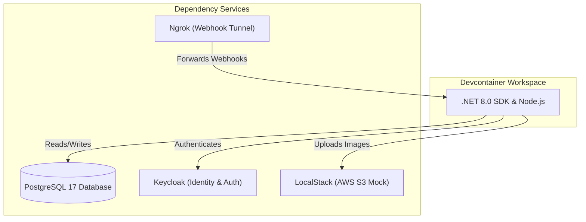

Tavern utilizes **VS Code/Rider Dev Containers** to ensure that all developers work in an identical environment, pre-configured with all system-level tools, SDKs, database backends, and external API simulators.

This removes the need to manually install databases, mock S3, setup Keycloak, or install language SDKs on the host machine.

---

## Devcontainer Orchestration (Docker Compose)

The development environment coordinates multiple containers. When the workspace is loaded, the container manager spins up the following services:

### Containerized Services Map:

1. **`db` (PostgreSQL 17):**
   * Configured via environment variables to host the core relational schemas and Hangfire background jobs.
   * Internal connections are made through port `5432`.
2. **`keycloak` (Keycloak 26.1):**
   * Orchestrates authentication and synchronization.
   * Auto-imports a local Tavern realm setup on startup. Accessible at port `8082`.
3. **`localstack` (LocalStack 3.0):**
   * Mocks AWS S3 APIs locally, allowing image uploads for user profiles and group pictures without incurring cloud costs.
   * Configured through AWS CLI credentials pointing to localhost.
4. **`ngrok` (Ngrok Tunnel):**
   * Runs a secure public tunnel to route webhook events (such as Mollie payment completion events) from the public web directly into the backend API container running inside the devcontainer.
   * Enables seamless debugging of real payment notifications.

---

## Integrated Extensions

To simplify local work, the `.devcontainer/devcontainer.json` configuration automatically provisions the following developer tooling on start:

* **C# Dev Kit (`ms-dotnettools.csdevkit`):** Full IDE support for C# compilation, unit testing, and IntelliSense inside VS Code.
* **Database Client (`cweijan.vscode-database-client2`):** Direct database explorer inside the IDE, enabling developers to query the local PostgreSQL database tables without third-party desktop apps.
