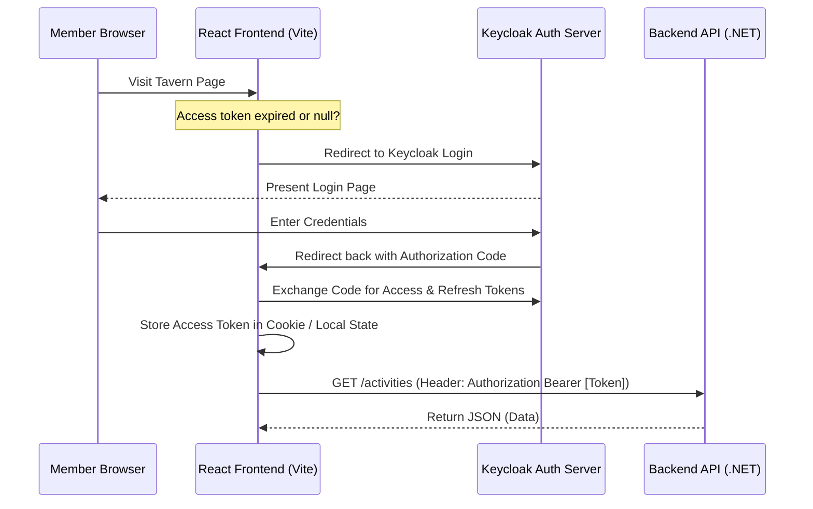

Tavern's user interface is a **React Single-Page Application (SPA)** built with the **React Router v7** framework, engineered for modularity, rapid loading, and modern design aesthetics.

---

## Technological Foundations

* **React Router v7:** Powers the client-side SPA routing system, layout nesting, page data loading, and layout skeletons.
* **Vite:** Acts as the build system and development server, replacing traditional Webpack setups for near-instant hot module replacement (HMR) and optimized production bundles.
* **TypeScript:** Ensures static typing across DTO schemas, UI components, and API routing.
* **Vanilla CSS (Design Tokens):** Standard CSS variables are declared globally to enforce consistent styling across fonts, spacing, custom colors (HSL palettes), and dark/light modes.
* **Biome:** Utilized for rapid linting and formatting on the frontend codebase (`biome ci .` in CI pipeline).

---

## Core Directory Structure

The frontend code is structured as follows:

```
Frontend/
├── app/                  # React Router framework root
│   ├── api/              # API clients & generated OpenAPI wrappers
│   ├── auth/             # Keycloak & OIDC authentication integration
│   ├── components/       # Reusable layout & UI components
│   ├── context/          # React Context state providers
│   ├── i18n/             # Translation files & localization tools
│   ├── layout/           # Shared page layouts
│   ├── routes/           # Route views & page page modules (e.g. Activities, Admin)
│   ├── types/            # TypeScript type definitions
│   ├── util/             # Utility and helper functions
│   ├── app.css           # Global Tailwind/CSS rules
│   ├── root.tsx          # Application root element and viewport shell
│   └── routes.ts         # Route configuration mapping path URLs to components
├── package.json
└── Dockerfile            # Multi-stage production container build config
```

---

## Authentication Flow (Keycloak Integration)

Tavern uses **Keycloak** as its Identity Provider. The frontend handles authentication using standard OpenID Connect (OIDC) protocols:



1. **Authentication Check:** Upon loading, the application checks for a valid access token. If missing or expired, it redirects the browser to the Keycloak authentication screen.
2. **Token Management:** After successful login, the frontend captures the token and stores it. A background token-refresh interval checks the token lifetime and triggers refresh token exchanges as needed.
3. **API Authorization:** Every outbound API request to the backend includes the retrieved JWT token in the `Authorization: Bearer <token>` header or as a secured cookie, granting programmatic access to authenticated resources.
