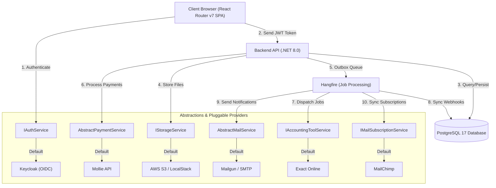

Tavern is built on a modern decoupled architecture that separates user interface interactions from business rule processing and transactional tasks.

A key architectural design principle in Tavern is the **Dependency Inversion Principle**. Core services do not depend directly on concrete third-party services (such as Keycloak, Mollie, or MailChimp). Instead, they interact via abstract interfaces. Concrete provider implementations (Adapters) are dynamically registered at startup based on environment variables.

### Core Architecture Components

Select one of the following architectural breakdowns to learn more:

* **[Backend Architecture](./Architecture/Backend)**
  Detailed layout of the ASP.NET Core Web API layers, transactional outbox pattern, and pluggable integration interfaces.
* **[Frontend Architecture](./Architecture/Frontend)**
  Visual design system, state tracking, and integration with authentication providers on the client.
* **[Devcontainer Architecture](./Architecture/Devcontainer)**
  Orchestration of Docker container environments (PostgreSQL, Keycloak, LocalStack, Ngrok) facilitating fully simulated local development.
